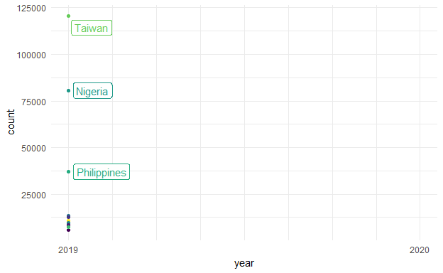

Although this plot isn't "polished," it was my first contribution to a Tidy Tuesday, which I partake in to continue my learning in R.

```{r setup, include=FALSE}
knitr::opts_chunk$set(echo = FALSE)

library(tidyverse)
library(tidytuesdayR)
library(gganimate)
library(png)
library(gifski)
library(directlabels)
library(ggrepel)

tuesdata <- tidytuesdayR::tt_load(2021, week = 5)

plastics <- tuesdata$plastics %>% 
  filter(!parent_company %in% c("Grand Total")) %>% 
  filter(!country %in% c("EMPTY")) %>% 
  pivot_longer(cols = empty:grand_total, 
               names_to = "plastic_type",
               values_to = "count") %>% 
  filter(!plastic_type == "grand_total") %>% 
  mutate(country = case_when(
      country == "NIGERIA" ~ "Nigeria",
      country == "Taiwan_ Republic of China (ROC)" ~ "Taiwan",
      country == "ECUADOR" ~ "Ecuador",
      country == "United States of America" ~ "USA",
      TRUE ~ country
    )) %>% 
  group_by(year) %>% 
  count(country, wt = count) %>% 
  rename("count" = "n") %>% 
  slice_max(count, n = 10)

countries_plot <- ggplot(plastics, aes(x = year, y = count, color = country)) +
  geom_point(aes(group = seq_along(year))) +
  geom_line() +
  #geom_dl(aes(x = year, y = count, color = country, label = country), method = list("last.points")) +
  theme_minimal() +
  theme(legend.position = "none") +
  scale_color_viridis_d() +
  geom_label_repel(aes(label = country),
                   seed = 456) +
  transition_reveal(year) +
  scale_x_continuous(labels = c("2019", "", "", "", "2020"))

countries_plot <- animate(countries_plot, renderer = gifski_renderer(), end_pause = 30)

countries_plot
anim_save("plastics.gif", countries_plot)


```


Top 10 countries and their plastic use (pieces of plastic found during cleanups) in 2019 and 2020.
